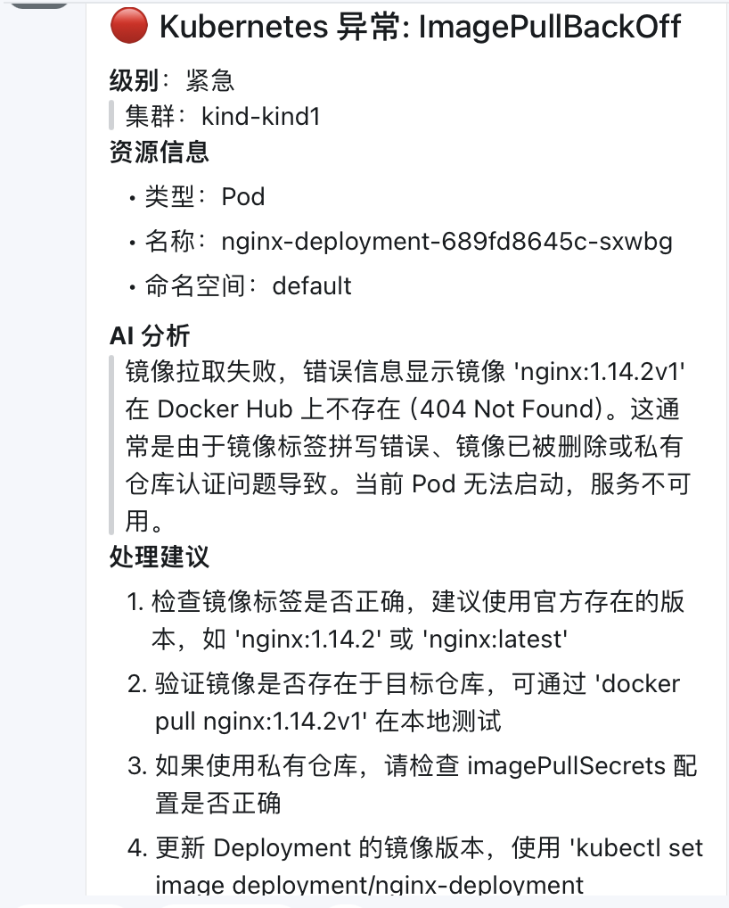

# KubePilot AI Controller

一个运行在 Kubernetes 内部的 AI SRE Controller。

## 快速部署到 kind

### 1. 创建 namespace 和 CRD
```bash
kubectl apply -f deploy/namespace.yaml
kubectl apply -f deploy/crd.yaml
kubectl apply -f deploy/rbac.yaml
```

### 2. 创建 Secret
将 `deploy/secret.yaml` 中的 API Key 替换为你的真实 key，然后：
```bash
kubectl apply -f deploy/secret.yaml
```

### 3. 构建镜像（可选）
如果 Docker Hub 可用：
```bash
docker build -t kubepilot-ai/kubeai-controller:v0.1.0 .
kind load docker-image kubepilot-ai/kubeai-controller:v0.1.0
```

### 4. 部署 Controller
```bash
kubectl apply -f deploy/deployment.yaml
```

### 5. 验证
```bash
kubectl get pods -n kubeai-system
kubectl logs -n kubeai-system -l app.kubernetes.io/name=kubepilot-ai-controller
```

## 测试

创建测试 AIIncident：
```bash
kubectl apply -f deploy/example-aiincident.yaml
```

查看状态：
```bash
kubectl get aiincident -n default
kubectl describe aiincident example-pod-crash -n default
```

图片：


