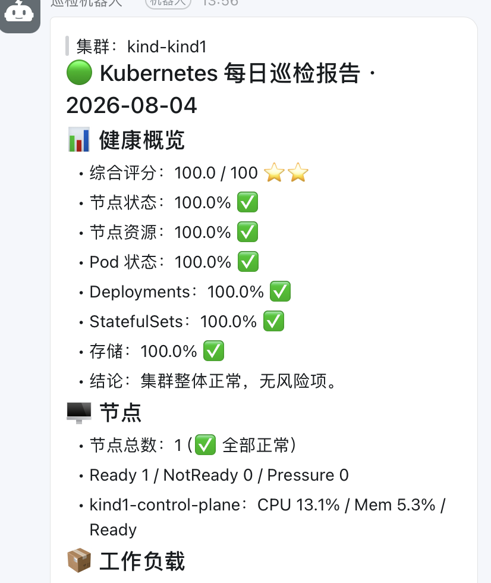

# KubePilot AI Controller

一个运行在 Kubernetes 内部的 AI SRE Controller。

## 快速部署到 kind

### 1. 创建 namespace 和 CRD
```bash
kubectl apply -f deploy/namespace.yaml
kubectl apply -f deploy/crd.yaml
kubectl apply -f deploy/rbac.yaml
```

### 2. 创建 Secret
将 `deploy/secret.yaml` 中的 API Key 替换为你的真实 key，然后：
```bash
kubectl apply -f deploy/secret.yaml
```

### 3. 构建镜像（可选）
如果 Docker Hub 可用：
```bash
docker build -t kubepilot-ai/kubeai-controller:v0.1.0 .
kind load docker-image kubepilot-ai/kubeai-controller:v0.1.0
```

### 4. 部署 Controller
```bash
kubectl apply -f deploy/deployment.yaml
```

### 5. 验证
```bash
kubectl get pods -n kubeai-system
kubectl logs -n kubeai-system -l app.kubernetes.io/name=kubepilot-ai-controller
```

## 每日巡检（计划任务）

巡检由 Controller 进程内定时触发（非 Kubernetes CronJob），默认每天 02:00（可通过环境变量修改），报告内容包含：
- 健康评分（节点状态/资源、Pod、工作负载、存储、安全配置、证书合规）
- 重点关注与建议操作（资源配额、高内存节点、镜像拉取失败、证书到期、空 Endpoints 等）
- 工作负载明细（Deployment/StatefulSet/DaemonSet）
- 计划任务与批处理明细
  - CronJob：Suspend、Active、lastScheduleTime 异常、未观察到执行、疑似漏跑（仅对常见 5 段表达式进行推断）
  - Job：失败 Job Top 列表（包含失败条件原因、运行时长、owner CronJob 关联）
- 节点补充检查：NotReady/压力条件、已封锁（Unschedulable）节点、Pod 数接近上限节点
- Pod 调度：Unschedulable（含调度器原因）、长时间 Pending、CrashLoopBackOff/ImagePullBackOff 等异常
- 安全与配置巡检：特权容器、hostNetwork/hostPID/hostIPC、root 用户、hostPath、latest 标签镜像、资源请求/限制缺失
- 证书巡检：TLS Secret 证书过期/临期（7 天/30 天）、Ingress 引用的 TLS Secret 缺失
- Service Endpoints 健康：带 selector 的 Service 无就绪 Endpoints
- 弹性伸缩与可用性：HPA 指标不可用/副本触顶触底、PDB DisruptionsAllowed=0
- 残留与闲置资源：卡住的 Terminating Pod/Namespace、超 7 天未清理的已完成 Job、无 Pod 引用的闲置 PVC
- 存储与配额：PVC/PV 异常、StorageClass 默认类、ResourceQuota 接近上限
- 网络入口：Service/Ingress LoadBalancer 地址未就绪
- 集群组件：kube-apiserver、kube-controller-manager、kube-scheduler、etcd、coredns、kube-proxy、metrics-server

> 扩展巡检（Endpoints/HPA/PDB/Namespace）需要 `deploy/rbac.yaml` 中对应的 RBAC 权限；权限缺失时相关章节自动跳过，不影响其余巡检。

## 测试

创建测试 AIIncident：
```bash
kubectl apply -f deploy/example-aiincident.yaml
```

查看状态：
```bash
kubectl get aiincident -n default
kubectl describe aiincident example-pod-crash -n default
```



